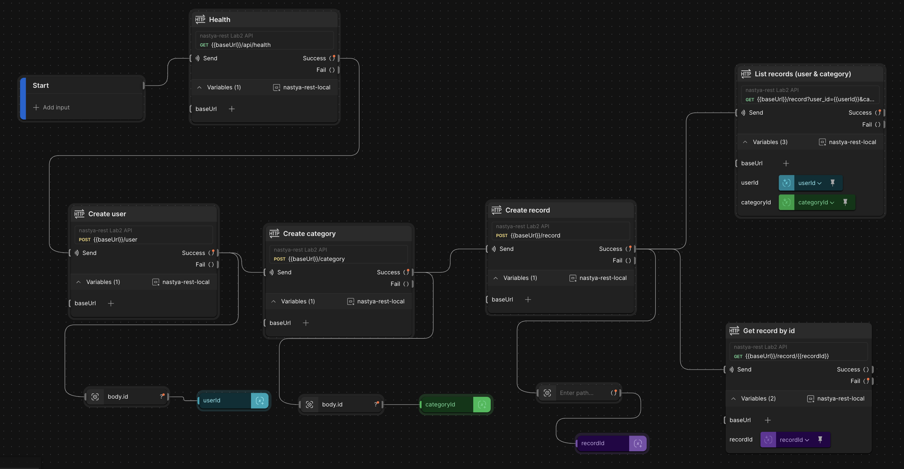

# nastya-rest — Expense Tracking REST API

This repository contains a small educational REST API built with **Node.js** and **Express**.
It is used for a series of university labs on backend development:

- **Lab 1** – Basic HTTP server + health-check endpoint
- **Lab 2** – In‑memory REST API for tracking expenses (users, categories, records)
- **Lab 3** – (Planned) Persistence with a real database and ORM
- **Lab 4** – (Planned) Authentication and authorization

> At the moment this README and the Postman collection describe the Lab 1–2 API:
> simple JSON endpoints without a database (data is stored in memory).

---

## Tech stack

- **Node.js** 20+
- **Express** 5
- **dotenv** (for environment variables)
- **nodemon** (for development)
- **Docker** (production image using Node 20 Alpine)

---

## Project structure

```text
src/
  app.js              # Express app configuration
  index.js            # Application entry point
  controllers/
    home.controller.js
    # (you can add more controllers here, e.g. users, categories, records)
  routes/
    index.js          # GET /
    api/
      health.js       # GET /api/health
  middlewares/
    errorHandler.js   # Centralized error handler
```

You can extend `controllers/` and `routes/` with additional files for Labs 2–4
(for example `users.controller.js`, `categories.controller.js`, `records.controller.js`,
and corresponding route files).

---

## Getting started (local)

### 1. Prerequisites

- Node.js 20 or newer
- npm (comes with Node.js)
- Optional: Docker, if you want to run the app in a container

### 2. Install dependencies

```bash
npm install
```

### 3. Environment variables

The project can be configured via a `.env` file in the root of the repository.

Supported variables:

```env
PORT=3000
NODE_ENV=development
```

- `PORT` – port for the HTTP server. Defaults to `3000` if not set.
- `NODE_ENV` – optional environment flag (`development`, `production`, etc.).

Example `.env`:

```env
PORT=3000
NODE_ENV=development
```

### 4. Run in development mode

Uses `nodemon` for automatic restart on file changes.

```bash
npm run dev
```

The server will start at:

```text
http://localhost:3000
```

### 5. Run in production mode (without Docker)

```bash
npm start
```

By default this will also listen on `PORT` (3000 if not set).

---

## Running with Docker

A simple Dockerfile is provided:

```Dockerfile
FROM node:20-alpine

WORKDIR /app

COPY package*.json ./

RUN npm ci --omit=dev

COPY src ./src

ENV NODE_ENV=production
ENV PORT=8080

EXPOSE 8080

CMD ["node", "src/index.js"]
```

### Build the image

```bash
docker build -t nastya-rest .
```

### Run the container

```bash
docker run --rm -p 8080:8080 nastya-rest
```

The API will then be available at:

```text
http://localhost:8080
```

If you deploy this image to a hosting platform (for example Render, Railway, etc.),
make sure the external URL is reflected in the Postman **prod** environment.

---

## API overview (Labs 1–2)

### 1. Basic endpoints

#### `GET /`

Returns a simple JSON greeting.

Example response:

```json
{
  "message": "Hello from Node.js + Express!"
}
```

#### `GET /api/health`

Health‑check endpoint with a timestamp.

Example response:

```json
{
  "status": "ok",
  "ts": "2025-01-01T12:34:56.789Z"
}
```

---

### 2. Planned REST resources (Lab 2)

The following resources are designed for the in‑memory expense tracking API:

- **Users** – people who own expense records
- **Categories** – types of expenses (food, transport, etc.)
- **Records** – individual expense entries (amount + user + category)

Below is the planned endpoint contract. You can implement these endpoints
in Express controllers and routes.

#### Users

| Method | URL              | Description                |
|--------|------------------|----------------------------|
| GET    | `/users`         | List all users             |
| GET    | `/user/:userId`  | Get a user by id           |
| POST   | `/user`          | Create a new user          |
| DELETE | `/user/:userId`  | Delete a user and their records |

**Example `POST /user` request body**

```json
{
  "name": "Alice"
}
```

**Example response**

```json
{
  "id": 1,
  "name": "Alice"
}
```

----

#### Categories

| Method | URL          | Description                        |
|--------|--------------|------------------------------------|
| GET    | `/category`  | List all categories                |
| POST   | `/category`  | Create a new category              |
| DELETE | `/category`  | Delete a category by `?id=` query  |

**Example `POST /category` request body**

```json
{
  "name": "Food"
}
```

----

#### Records

| Method | URL                        | Description                                            |
|--------|----------------------------|--------------------------------------------------------|
| GET    | `/record`                  | List records filtered by `user_id` and/or `category_id` |
| GET    | `/record/:recordId`        | Get a single record by id                              |
| POST   | `/record`                  | Create a new expense record                            |
| DELETE | `/record/:recordId`        | Delete a record                                        |

**Query parameters for `GET /record`**

- `user_id` – optional, integer
- `category_id` – optional, integer  
  At least one of these parameters should be provided.

**Example `POST /record` request body**

```json
{
  "userId": 1,
  "categoryId": 1,
  "amount": 123.45
}
```

**Example response**

```json
{
  "id": 1,
  "userId": 1,
  "categoryId": 1,
  "amount": 123.45,
  "createdAt": "2025-01-01T12:34:56.789Z"
}
```

---

## Using the Postman collection

In the `nastya-rest.postman_collection.json` file you will find ready‑made requests
for:

- `GET /` (home)
- `GET /api/health`
- Users: `GET /users`, `GET /user/:userId`, `POST /user`, `DELETE /user/:userId`
- Categories: `GET /category`, `POST /category`, `DELETE /category?id=...`
- Records: `GET /record`, `GET /record/:recordId`, `POST /record`, `DELETE /record/:recordId`

The collection uses a single variable:

- `{{baseUrl}}` – base URL of the API.

Two Postman **environments** are provided:

- `nastya-rest-local` – for local development
  - `baseUrl = http://localhost:3000`
- `nastya-rest-prod` – for Docker / production
  - `baseUrl = https://nastya-rest-865o.onrender.com` (or your actual deployment URL)

## Using the Postman flow

Postman flow for Lab2:



### Steps

1. Import the **collection** file into Postman.
2. Import the **local** and **prod** environment files.
3. Select the desired environment (local or prod).
4. Send requests and inspect responses.

---

## Notes

- Since Lab 2 stores data in memory, all users, categories, and records are reset
  every time the server restarts.
- For Labs 3–4 you can replace the in‑memory store with a real database
  and add authentication middleware that protects the main endpoints.
